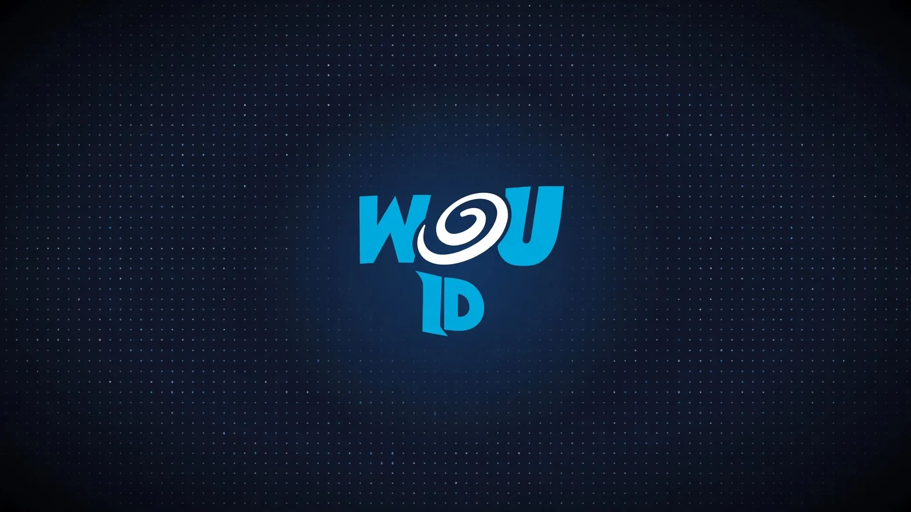

# 🛡️ World of Unreal Identity (`wou-id`)



> **WouID — the identity engine behind every World of Unreal game and site.**
> One canonical `account_id` per player, stable across login methods and
> projects. Live at `https://id.worldofunreal.com`, running in its own jail
> on IONOS.

[](https://www.rust-lang.org)
[](LICENSE)
[](https://stalw.art)

The full rules live in [`docs/identity-contract.md`](docs/identity-contract.md):
games own progression and economy under `account_id`; WOU-ID owns identity,
sessions, verified email, and provider links. Email is a login method, never
an account key — unverified or conflicting emails never auto-merge accounts.

---

## 🌟 What it does

* **Anonymous-first entry:** guests play instantly with a canonical bearer ID,
  zero login walls. Session TTL 30d; revocation is the real control.
* **Email OTP:** 6-digit codes via our own Stalwart mail server (DKIM + SPF
  `-all` + DMARC `p=reject`, RFC 8058 one-click unsubscribe).
* **Social OAuth:** Google, Discord, X, Meta/Facebook, Apple, plus Play Games
  on the Android-native path. Callbacks pinned server-side, S256 PKCE for X.
* **Web3:** Ethereum SIWE + Solana SIWS linking, plus identity-owned embedded
  vault wallets (re-derived from the seed on boot migration).
* **Web portals:** CrazyGames, Poki, GameDistribution token verification.
* **QR login:** approve a desktop session from your phone.
* **Bots:** Telegram webhooks + Discord interactions, linkable to accounts.
* **Sessions:** short-lived JWTs (`jti` revocation), refresh, `/me`, logout.
* **Public profiles:** usernames, search, player lookup, media uploads
  (served from `id.worldofunreal.com/uploads`).
* **Clans & social:** create/join/leave, follow graph, global feed, activity.
* **Inventory & trades:** collect, direct trades with accept/cancel.
* **Custodial assets + marketplace:** collections, claims, transfers,
  freeze/restore, provenance events, listings with buy/cancel, faucet,
  SPIRAL balances.
* **Newsletter:** double opt-in subscribe, one-click unsubscribe.

---

## 📦 Workspace Crates

| Crate | Purpose |
| :--- | :--- |
| **[`wou-core`](crates/wou-core)** | Domain models: `PlayerAccount`, `LinkedIdentity`, `AuthProvider`, `UserProfile`, session claims. |
| **[`wou-mail`](crates/wou-mail)** | Stalwart SMTP transport with branded per-game HTML templates. |
| **[`wou-crypto`](crates/wou-crypto)** | OTP generation, JWT manager, SIWE/SIWS, OAuth exchanges, CrazyGames verifier. |
| **[`wou-storage`](crates/wou-storage)** | Valkey (hot: sessions, OTPs, rate limits) + Redb (durable player table with identity indexes). |
| **[`wou-server`](crates/wou-server)** | Axum REST API, CORS, routes, health. Binary: `wou-server`. |
| **[`wou-client`](crates/wou-client)** | Rust client SDK, native + `wasm32-unknown-unknown`. |
| **[`@worldofunreal/id`](id)** | TypeScript package: auth client + official sign-in modal for every frontend. |

---

## 🚀 REST API Reference

Base: `https://id.worldofunreal.com`. Health: `GET /health` → `WOU-ID Online 200 OK`.

### Auth — anonymous, OTP, sessions

```http
POST /api/v1/auth/anonymous          # boot as guest -> account_id + session
POST /api/v1/auth/otp/request        # (alias: /otp/send) 6-digit code by email
POST /api/v1/auth/otp/verify         # promote guest -> permanent account
GET  /api/v1/auth/me                 # current session account
POST /api/v1/auth/refresh            # rotate session JWT
POST /api/v1/auth/logout             # revoke session
```

### Auth — OAuth, QR, Web3, portals

```http
GET  /api/v1/auth/oauth/config
GET  /api/v1/auth/oauth/login/:provider      # google | discord | x | meta | apple ...
POST /api/v1/auth/oauth/callback/:provider
POST /api/v1/auth/qr/start
POST /api/v1/auth/qr/:id/status
POST /api/v1/auth/qr/:id/approve
POST /api/v1/auth/qr/:id/cancel
POST /api/v1/auth/web3/challenge
POST /api/v1/auth/web3/verify
POST /api/v1/auth/link/crazygames
POST /api/v1/auth/link/ethereum
POST /api/v1/auth/link/solana
```

### Bots

```http
POST /api/v1/bots/link/start
GET  /api/v1/bots/linked
POST /api/v1/bots/link/:ns
POST /api/v1/bots/telegram          # Telegram webhook
POST /api/v1/bots/discord           # Discord interactions
```

### Profiles, clans, social

```http
GET  /api/v1/user/profile/:id
PUT  /api/v1/user/profile/:id
GET  /api/v1/user/by-username/:username
GET  /api/v1/user/check-username/:username
GET  /api/v1/user/search
POST /api/v1/user/upload-media
POST /api/v1/clans/create
GET  /api/v1/clans/list
GET  /api/v1/clans/:tag
POST /api/v1/clans/:tag/join
POST /api/v1/clans/:tag/leave
POST /api/v1/social/follow/:target_id
POST /api/v1/social/unfollow/:target_id
GET  /api/v1/social/graph/:account_id
GET  /api/v1/social/feed
POST /api/v1/social/activity
```

### Inventory, assets, marketplace

```http
GET  /api/v1/inventory/me
POST /api/v1/inventory/collect
GET  /api/v1/inventory/:id
POST /api/v1/inventory/trade
GET  /api/v1/inventory/trades
GET  /api/v1/inventory/trade/:id
POST /api/v1/inventory/trade/:id/accept
POST /api/v1/inventory/trade/:id/cancel
GET  /api/v1/assets/collections
POST /api/v1/assets/collections
GET  /api/v1/assets/collections/:id/tokens
POST /api/v1/assets/claim
POST /api/v1/assets/transfer/:id
POST /api/v1/assets/freeze/:id
POST /api/v1/assets/restore/:id
GET  /api/v1/assets/:id
GET  /api/v1/assets/owner/:account
GET  /api/v1/assets/:id/events
POST /api/v1/assets/faucet
GET  /api/v1/assets/balance/me
GET  /api/v1/assets/listings
POST /api/v1/assets/listings
POST /api/v1/assets/listings/:id/cancel
POST /api/v1/assets/listings/:id/buy
```

### Newsletter

```http
POST /api/v1/newsletter/subscribe
POST /api/v1/newsletter/unsubscribe
```

### Internal (bearer-protected, never public)

```http
POST /api/v1/internal/identity/resolve
POST /api/v1/internal/profile/reset-test-data   # dry-run by default; real reset needs exact text RESET_HUMAN_TEST_DATA
```

---

## 💻 Quickstart (TypeScript)

```typescript
import { WouIdClient } from '@worldofunreal/id';

const auth = new WouIdClient({ baseUrl: 'https://id.worldofunreal.com' });

// 1. Boot game immediately as anonymous
const { account, session_token } = await auth.startAnonymous('shadowsofwar');

// 2. When player wants to save progress:
await auth.requestOtp('player@gmail.com', 'shadowsofwar');

// 3. User submits 6-digit code:
const verified = await auth.verifyOtp('player@gmail.com', '849201', 'shadowsofwar');
```

See [`id/AGENTS_GUIDE.md`](id/AGENTS_GUIDE.md) for the frontend integration rules.

---

## 🛠️ Build, test, operate

```bash
cargo check --workspace
cargo test --workspace
cargo build --release --bin wou-server
```

* **Deploy:** push to `main` runs [`.github/workflows/deploy.yml`](.github/workflows/deploy.yml)
  (builds on FreeBSD, installs into the `wou-id` jail, syncs nginx config,
  verifies health + jail isolation). The [`wou`](wou) Python CLI mirrors the
  same steps for local/assisted operation — no pip dependencies.
* **Repo config:** [`deploy/`](deploy/) holds the jail, nginx, service, and
  env-template files. Copy `deploy/wou-id.env.template` to the env file;
  secrets are never committed.
* **Runtime layout (IONOS):** jail `wou-id` (`/zroot/jails/wou-id`), binary at
  `/usr/local/libexec/wou-server`, logs at `/var/log/wou-id/server.log`,
  nginx at `/usr/local/etc/nginx/conf.d/id.worldofunreal.com.conf`.

---

## 📜 License

Licensed under either of [Apache License, Version 2.0](LICENSE-APACHE) or [MIT License](LICENSE-MIT) at your option.
